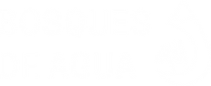

<div align="center">
  
  </br>
  </br>

</div>

# App Control

Bosques de Agua App Control is a web application for controlling and monitoring appliances.

## Getting Started

These instructions will get you a copy of the project up and running on your local machine for development and testing purposes.

### Prerequisites

- [Go](https://golang.org/)
- [Podman](https://podman.io/)

### Installation

1.  **Clone the repository:**

    ```sh
    git clone git@github.com:masch/bda-app-control.git
    ```

2.  **Set up the database:**

    This project uses a PostgreSQL database. You can use the following `podman` commands to start a PostgreSQL container:

    - **Pull and init database container:**

      ```sh
      make db-init
      ```

    - **Test the database connection:**

      ```sh
      podman exec -it bda-db psql -U tabaquillo -d bosque
      ```

    - **Reset the database (optional):**

      ```sh
      podman stop bda-db && \
      podman rm bda-db && \
      podman volume rm bda-pgdata
      ```

3.  **Set up the environment variables:**

    Create a `.env` file in the root of the project with the following content using `.env.template` file as a template:

    ```
    DB_HOST=
    DB_NAME=
    DB_USERNAME=
    DB_PASSWORD=
    VERSION=
    ```

## Usage

To run the web server, execute the following command from the root of the project:

```sh
go run ./cmd/web
```

The application will be available at [http://localhost:4000/bosquesdeagua](http://localhost:4000/bosquesdeagua).

## Technologies Used

- [Go](https://golang.org/)
- [PostgreSQL](https://www.postgresql.org/)
- [bun](https://bun.uptrace.dev/) - SQL-first Golang ORM

## Contributing

Please read [CONTRIBUTING.md](CONTRIBUTING.md) for details on our code of conduct, and the process for submitting pull requests to us.

## License

This project is licensed under the MIT License - see the [LICENSE](LICENSE) file for details.
